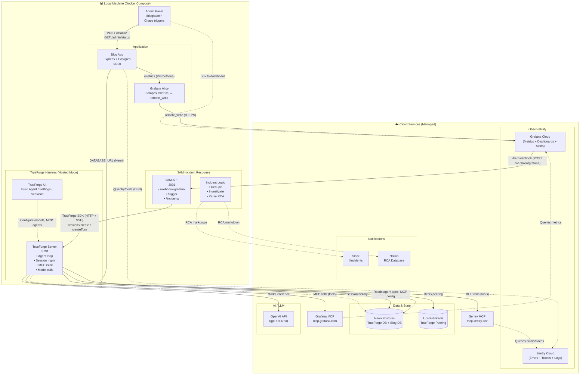
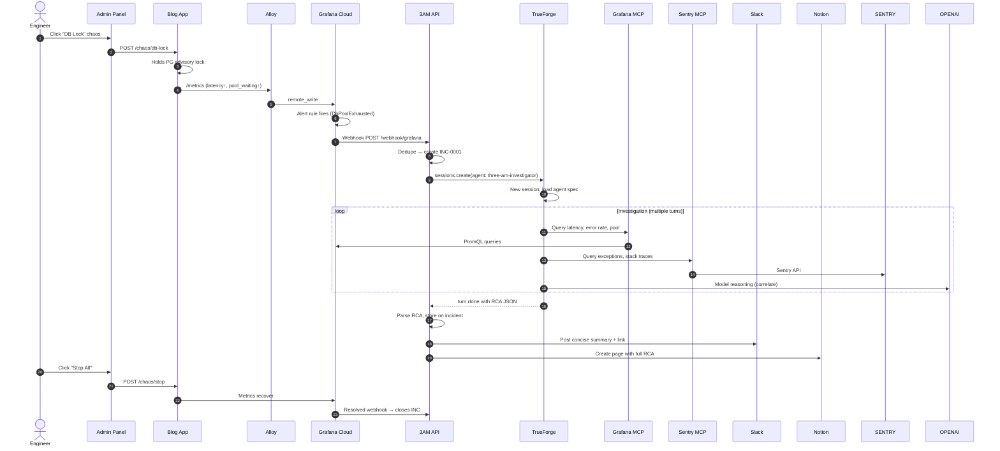

# 3AM — End-to-End Architecture

---

## Component Responsibilities

| Layer | Component | Responsibility |
|-------|-----------|----------------|
| **Trigger** | Grafana Cloud | Evaluates PromQL alerts → fires webhook to 3AM |
| **Ingest** | 3AM API (`:3001`) | Receives webhook, deduplicates, creates `INC-xxxx` |
| **Orchestrate** | 3AM Logic | Calls TrueForge SDK → opens session → streams investigation |
| **Reason** | TrueForge Server (`:8791`) | Runs agent loop: plans → calls LLM → executes MCP tools → returns RCA |
| **Investigate** | Agent (via TrueForge) | Queries **Grafana MCP** (metrics) + **Sentry MCP** (errors) → correlates → outputs structured RCA JSON |
| **Notify** | 3AM (Phase 6) | Posts RCA to Slack + Notion |
| **Simulate** | Admin Panel + Chaos | Generates realistic incidents (DB lock, latency, traffic spike, etc.) |
| **Observe** | Blog + Alloy + Grafana Cloud | App exposes `/metrics` → Alloy scrapes → Cloud stores → dashboards + alerts |
| **Errors/Traces** | Blog + Sentry SDK | Auto-captures exceptions, spans, logs → Sentry Cloud |

---

## Data Flow (Incident Lifecycle)

---

## Ports & Endpoints (Local)

| Service | Port | Key Endpoints |
|---------|------|---------------|
| Blog | 3000 | `GET /posts`, `GET /metrics`, `POST /chaos/*`, `GET /admin` |
| Alloy | 12345 | Debug UI, component health |
| TrueForge | 8791 | UI, `POST /api/v1/sessions`, `POST /api/v1/sessions/:id/turns` |
| 3AM | 3001 | `POST /webhook/grafana`, `POST /trigger`, `GET /incidents/:id` |
| Grafana Cloud | 443 | Dashboards, alerts, contact points |
| Sentry Cloud | 443 | Issues, Performance, Logs |

---

## Credentials (All via `.env` — Nothing Hardcoded)

| Variable | Used By | Purpose |
|----------|---------|---------|
| `DATABASE_URL` (Neon blog) | Blog | Primary Postgres |
| `TRUEFORGE_DATABASE_URL` (Neon) | TrueForge | Agent DB |
| `REDIS_URL` (Upstash) | TrueForge | Replica peering |
| `SENTRY_DSN` | Blog | Error/trace capture |
| `GCLOUD_*` | Alloy | Grafana Cloud remote_write |
| `GRAFANA_CLOUD_TOKEN` | TrueForge MCP | Grafana MCP header auth |
| `OPENAI_API_KEY` | TrueForge | Model inference |
| `SLACK_BOT_TOKEN`, `NOTION_TOKEN` | 3AM (Phase 6) | Notifications |

---

## Demo Script (60 seconds)

1. **Open** `http://localhost:3000/admin` → "Start Normal Traffic"
2. **Show** `http://fearlessavocado2394.grafana.net/d/blog-overview` — healthy
3. **Click** "DB Lock" in admin → Grafana p95 spikes, pool waiting ↑
4. **Alert fires** → webhook hits 3AM → `INC-0001` created
5. **TrueForge session opens** → agent queries Grafana MCP + Sentry MCP
6. **RCA lands** → Slack (summary) + Notion (full)
7. **Click** "Stop All" → metrics recover → incident auto-closes